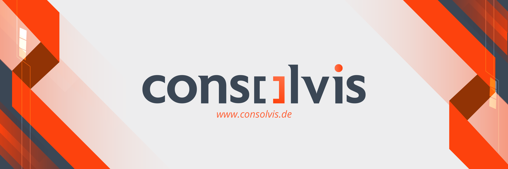

---

# 👋 Hey there, I'm **Tobias** 👨‍🚀

A fellow voyager in the dynamic realm of IT, currently navigating the SAP seas as a **Consultant** at **[@Consolvis GmbH](https://www.consolvis.de/)**. Here, I delve into the **SAP Business Technology Platform** depths to uncover treasures that enable and transform business processes. 🚀💼

  
<b>👨†Learn more about me</b>

 

My journey has led me across diverse roles - from being a meticulous <b>Project Management Officer</b> to an inventive <b>Developer</b> and a strategic <b>Solution Architect</b>. 🕰️ Every role offered a fresh perspective, a new challenge, and a chance to refine my skills.

By turning complex technical concepts into digestible strategies, I empower businesses to focus on their core mission. My expertise lies in creating innovative solutions using **SAP Business Technology Platform** and crafting them with **TypeScript**. 🛠️💡

I've always found myself at the exciting intersection of business and IT, building bridges and facilitating seamless dialogues. From Bahrain 🇧🇭 to New Zealand 🇳🇿, I've worked on a variety of projects, each one enriching my understanding and fueling my passion for technology. 🌍

At heart, I'm a programmer just like you, making the same mistakes, learning from them, and sharing my thoughts and mistakes. It's in this shared growth and camaraderie that the real magic happens. 🧩💡

I envision a future where technology simplifies and automates everyday business processes. 💫🔮 As we code toward this promising future, I believe in learning, growing, and evolving together as a community.

 

  
<b>:telescope: My 2023 Goal: Consistency is Key! 🔑</b>

 

In the spirit of embracing change and continuous growth, 2023 holds a vibrant new challenge for me.

This year, I'm steering towards the exciting world of <a href="https://www.youtube.com/@consolvis">YouTube</a>, with a goal to consistently share my insights, experiences, and learnings from the SAP and TypeScript arenas. From the triumphs to the stumbles, every moment is an opportunity for growth, and I'm committed to bringing these lessons to you. Picture it as a tech travelogue, where we navigate the complex terrains of IT together, learning from each other and growing as a community.

So, stay tuned, and let's boldly venture into the future, enriched by shared knowledge and camaraderie! 🚀👥

 

When I'm not coding, I'm sharing my journey, learnings, and insights on [LinkedIn](https://www.linkedin.com/in/tobias-steckenborn/), [Twitter](https://twitter.com/TSteckenborn), and [YouTube](https://www.youtube.com/@consolvis?sub_confirmation=1). The future isn't a place we're going to, it's something we're creating, and paths to it aren't found but made. So, let's make it together! 🚀🌍

## 📫 Reach me on

## 📹 Latest videos on [my Youtube Channel](https://www.youtube.com/@consolvis?sub_confirmation=1)

 

 

## 📝 Latest Blog Posts on [Consolvis.de](https://www.consolvis.de/blog/):

 

 Title | Published On |
 ----- | ------------ |
| **[Executing simple REST requests with SAP CAP applications](https://www.consolvis.de/en/blog/executing-simple-rest-requests-with-sap-cap-applications/)** | Fri Jul 23 2021 |
| **[Prevent a whole category of errors in your SAP CAP applications with a few simple tools](https://www.consolvis.de/en/blog/prevent-errors-in-your-sap-cap-applications-with-tools/)** | Tue Jul 20 2021 |
| **[🤩 52 BEST VSCODE EXTENSIONS TO IMPROVE YOUR PRODUCTIVITY IN 2021](https://www.consolvis.de/en/blog/52-best-vscode-extensions-to-improve-your-productivity-in-2021/)** | Tue Jul 13 2021 |
| **[How to load initial data into nested entities](https://www.consolvis.de/en/blog/how-to-load-initial-data-into-nested-entities/)** | Mon Jun 21 2021 |
| **[Beautify your Windows PowerShell in Visual Studio Code](https://www.consolvis.de/en/blog/beautify-your-windows-powershell-in-visual-studio-code/)** | Thu Jun 10 2021 |

 

## 📝 Latest Blog Posts in the [SAP Community](https://people.sap.com/tobias_steckenborn):

 

 Title | Published On | Engagement |
 ----- | ------------ | ---------- |
| **[Five SAP Cloud Certifications in 10 Days: New Year’s Resolution Challenge](https://blogs.sap.com/2021/12/27/five-sap-cloud-certifications-in-10-days-new-years-resolution-challenge/)** | Mon Dec 27 2021 | 👍 54 ・ 💬 22 ・ 👁️ 27,623 |
| **[Executing simple REST requests with SAP CAP applications](https://blogs.sap.com/2021/07/30/executing-simple-rest-requests-with-sap-cap-applications/)** | Fri Jul 30 2021 | 👍 14 ・ 💬 2 ・ 👁️ 6,541 |
| **[Developing on BTP: The SAP BTP Community - A Guide for Busy Experts](https://blogs.sap.com/2021/04/07/developing-on-btp-the-sap-btp-community-a-guide-for-busy-experts/)** | Wed Apr 07 2021 | 👍 38 ・ 💬 13 ・ 👁️ 4,240 |
| **[How to prepare for SAP certifications - My experience after passing 11 certifications](https://blogs.sap.com/2021/01/10/how-to-prepare-for-sap-certifications-my-experience-after-passing-11-certifications/)** | Sun Jan 10 2021 | 👍 29 ・ 💬 6 ・ 👁️ 30,304 |
| **[Achieve your 2021 goals with the communities help](https://blogs.sap.com/2020/12/28/achieve-your-2021-goals-with-the-communities-help/)** | Mon Dec 28 2020 | 👍 9 ・ 💬 0 ・ 👁️ 481 |

 

## 💼 Tools of Trade

 

 

 

 

### Show some ❤️

